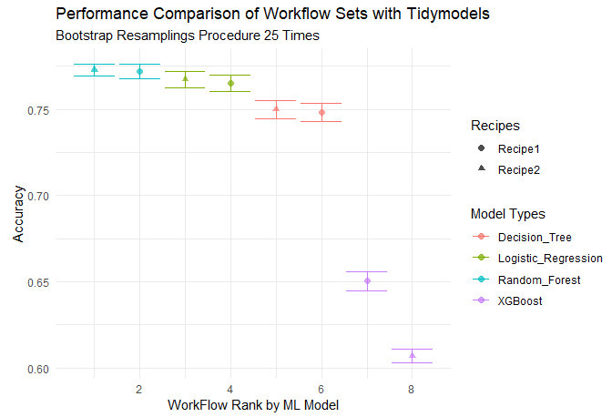

  


-----
## Classification with Tidymodels

----

## 개요

● 새로운 ML 라이브러리인 tidymodels를 활용하여 분류 모델을 개발

## 대회목적

● 대출 승인 여부를 결정하는 모델을 만드는 것이 대회의 주 목적이며,

  평가지표는 분류모형의 Accurarcy 로 결정한다.

### 패키지 및 데이터 볼러오기

#### 필수 패키지 불러오기

### 데이터 수집
```python
library(readr)
```
### 데이터 가공
```python
library(dplyr) # 데이터 가공

library(tidyr) # 컬럼 변경

library(stringr) # 문자열 데이터 다루기 

library(forcats) # 범주형 데이터 다루기

library(skimr) # 데이터 요약

library(magrittr) # 파이프라인 작성
```

### 데이터 시각화
```python
library(ggplot2) # 데이터 시각화 

library(corrr) # 상관관계 시각화

library(skimr) # 데이터 요약

library(patchwork) # 데이터 시각화 분할

library(GGally) # 산점도
```
#### 아래는 모델을 서로 비교한 최종 결과 사진.



## 모델학습
```python
set.seed(2)
train_resamples = bootstraps(training(loan_split), strata = Loan_Status)
detectCores()
```

## 모델학습 비교

● 이제 모형 학습이 완료가 되었다면, 시각화로 어떤 모델이 좋은지를 확인해보도록 한다.

● 우선 학습된 데이터를 확인해보도록 한다.

```python
library(tune)
collect_metrics(all_workflows)
```
● 현재 결과물에서 accuracy에서 추출하고, 그 외 필요한 데이터 가공을 진행하도록 한다.
```python
collect_metrics(all_workflows) %>% 
  tidyr::separate(wflow_id, into = c("Recipe", "Model_Type"), sep = "_", remove = F, extra = "merge") %>% 
  filter(.metric == "accuracy") %>% 
  group_by(model) %>% 
  select(-.config) %>% 
  distinct() %>% 
  group_by(Recipe, Model_Type, .metric) %>% 
  summarise(mean = mean(mean), 
            std_err = mean(std_err), .groups = "drop") %>% 
  mutate(Workflow_Rank = row_number(-mean), 
         .metric = str_to_upper(.metric)) %>% 
  ggplot(aes(x = Workflow_Rank, y = mean, shape = Recipe, color = Model_Type)) + 
  geom_point(size = 2, alpha = 0.7) + 
  geom_errorbar(aes(ymin = mean-std_err, ymax = mean + std_err), position = position_dodge(0.9)) + 
  theme_minimal() + 
  labs(title = "Performance Comparison of Workflow Sets with Tidymodels", 
       subtitle = "Bootstrap Resamplings Procedure 25 Times", 
       caption = "Image Created By McBert", 
       x = "WorkFlow Rank by ML Model", 
       y = "Accuracy", 
       color = "Model Types", 
       shape = "Recipes")
```
[1TEAM_Project_Source](https://github.com/kjw1390/Project/tree/main/R_Project/source)

[1TEAM_Project_data](https://github.com/kjw1390/Project/tree/main/R_Project/data)